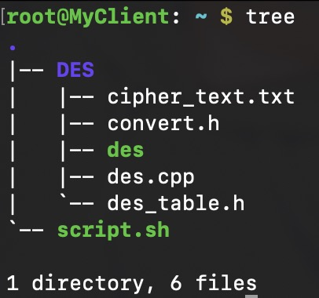

# Keamanan Infomasi - DES

Implementasi pertukaran message menggunakan DES pada 2 komputer

## Topologi

IP `MyClient`: 192.168.1.2
IP `MyServer`: 192.168.1.3

## Setup SSH

untuk melakukan menghubungkan 2 komputer agar dapat berkomunikasi saya menggunakan ssh

pada `MyServer`:

1. ubah password menggunakan `passwd`
2. konfigurasi `/etc/ssh/sshd_config` agar bisa melakukan ssh root dengan mengubah `PermitRootLogin` yes
3. restart ssh dengan `service ssh restart`

pada `MyClient`:

1. cek apakah sudah bisa terhubung dengan `MyServer` melalui ssh
2. cek dengan command `ssh root@192.168.1.3`

## Cara Kerja

pada directory `MyClient` terdapat susunan file sebagai berikut:

Cara menggunakan di Client:
1. jalankan `scpript.sh` dengan argument message yang ingin di DES sebanyak tepat 8 karakter
2. masukkan password ssh `MyServer`
3. pesan akan terkirim (dalam bentuk file) ke `MyServer`

Cara Kerja di Client:
1. script akan menjalankan code `des.cpp` pada `DES/` dan akan memasingkan argumen yang akan di enkripsi menggunakan DES
2. pada `des.cpp`, argumen akan di enkripsi dan hasil dari encripsi akan di letakkan pada sebuah file yang terletak pada `~DES/cipher_text.txt`
3. file cipher_text kemudian di kirimkan ke root directory `MyServer` melalui ssh menggunakan `scp DES/cipher_text.txt root@192.168.1.3:~/`

pada directory `MyClient` terdapat susunan file sebagai berikut:

Cara menggunakan di Server:
1. jalankan `scpript.sh`
2. pesan yang telah didekripsi akan di-print pada console

Cara Kerja di Server:
1. script akan menjalankan code `des.cpp` dengan inputan dari file `cipher_text.txt` yang telah dikirim oleh `MyClient`
2. `des.cpp` akan menampilkan isi text dari `chiper_text.txt` yang telah didekripsi

